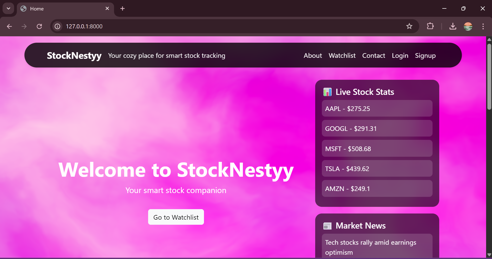
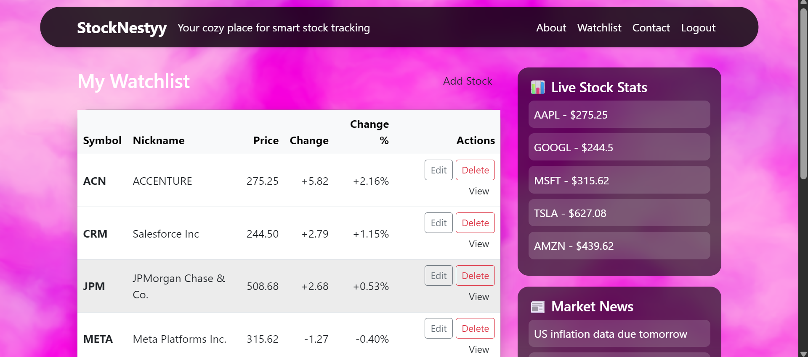
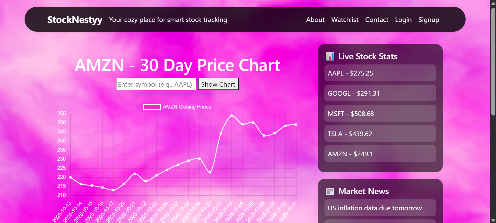
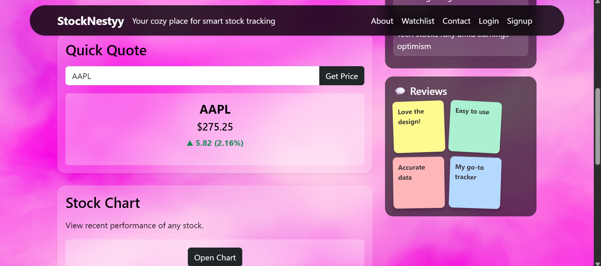
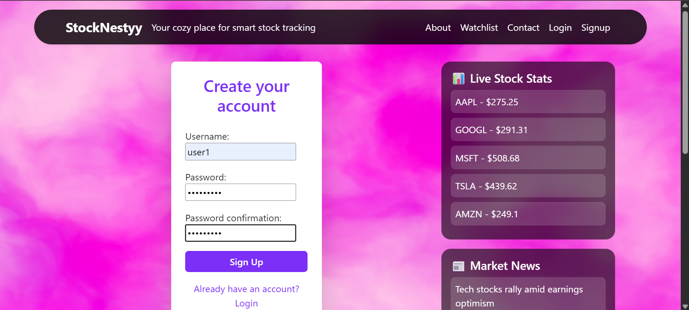

📈 Stock Tracker Web App — StockNestyy

A **Django-based stock market tracking application** that allows users to monitor real-time stock data, manage their watchlist, and view detailed stock charts — with enhanced visuals powered by **Vanta.js fog effects** and **Chart.js** for interactive data visualization.

---

## 🚀 Features

🔑 **User Authentication**
- Sign up, log in, and log out with Django’s built-in authentication system.

📊 **Personal Watchlist**
- Add, edit, and delete stocks from your personalized watchlist.

⏱️ **Real-Time Stock Data**
- Fetched using [`yfinance`](https://pypi.org/project/yfinance/) (Yahoo Finance API).
- Displays live prices, daily change, and percent difference.

📈 **Stock Chart Visualization**
- Dynamic chart rendering using **Chart.js** for historical and live trends.

⚡ **Quick Quote**
- Instantly search for any company ticker (e.g., AAPL, TSLA, GOOG) and view its live price with profit/loss indicators in green/red.

📰 **Latest Market News**
- Rotating news cards with up-to-date financial headlines.

🎨 **Modern UI/UX**
- Built with **HTML**, **CSS**, **JavaScript**, and **Bootstrap**.
- Features **glassmorphism design**, sticky-note cards, and animated **Vanta.js Fog** backgrounds for an immersive experience.

---

## 🛠️ Tech Stack

Backend: Django, Python

Frontend: HTML, CSS, Bootstrap

Database: SQLite (default, can be switched to PostgreSQL/MySQL)

APIs/Libraries:

yfinance → stock price data

Django Auth → user management

---


## ⚙️ Installation

### Clone the repository

```bash
git clone https://github.com/Arundhati15/StockNestyy.git
cd stocknestyy
```

### Create & activate a virtual environment

```bash
python -m venv venv
source venv/bin/activate   # On Linux/Mac
venv\Scripts\activate      # On Windows
```

### Install dependencies

```bash
pip install -r requirements.txt
```

### Apply migrations

```bash
python manage.py migrate
```

### Run the development server

```bash
python manage.py runserver
```

### Open in browser

👉 [http://127.0.0.1:8000/](http://127.0.0.1:8000/)

---

## 👤 Usage

* Sign up or log in to manage your personal watchlist.
* Add your favorite stocks and track live performance.
* Use **Quick Quote** for instant stock lookups.
* View **interactive stock charts** for trends and analysis.
* Stay updated with **auto-rotating market news**.

---

## 📷 Screenshots

### 🏠 Homepage



### 📊 Watchlist



### 📈 Chart Section



### 🎯 Quick Quote



### 🔐 Signup



---

## 📌 Notes

This project is for personal or portfolio use only.
Feel free to modify and extend it for learning purposes.

---

## 🧠 Future Enhancements

* Historical data analysis
* Dark mode toggle
* REST API endpoints (Django REST Framework)
* Email alerts for price changes

---

## 👩‍💻 Author

Developed with ❤️ using **Django**, **yfinance**, and **Chart.js**.

---

## 📦 Requirements

```txt
Django>=5.0,<6.0
yfinance>=0.2.40
requests>=2.32.0
```

